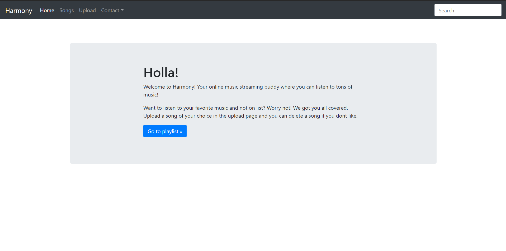
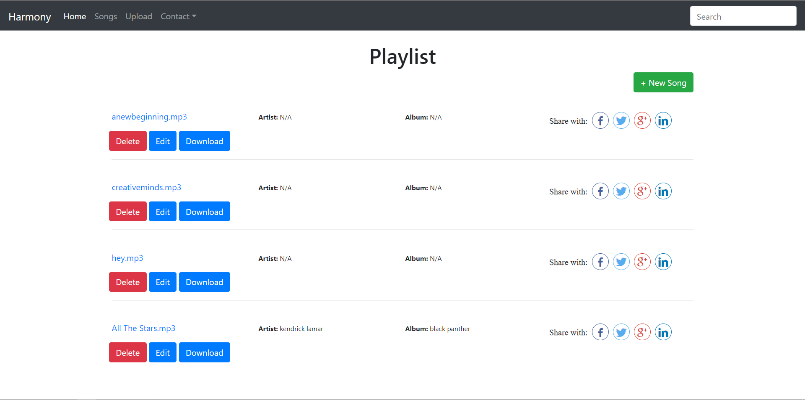
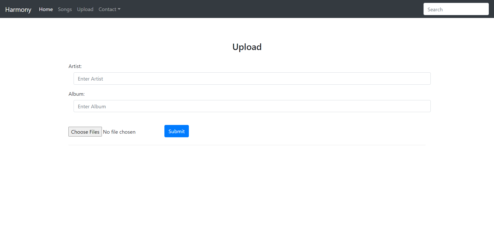

<div class="ui small rounded images">
  
  
  
</div>

A Music management/sharing/streaming platform built using Python and CRUD functionalities.

- Framework used: Flask
- Back-end: Python
- Front-end: Bootstap
- Database: SQLite


## Features

- Play music
- Manage playlist by adding one or multiple songs
- Delete or Edit song
- Download songs
- Share songs you like to social media

## Prerequisites

- Python 3.0
- mysql
- HTML and Bootstrap

## Packages required

- flask
- flask_sqlalchemy
- sqlite3
- io
- flask_share

## Installing Packages

Open terminal and write the following:
```
pip3 install -r requirements.txt
```

## Importing Database

- Open terminal
- Go to the file directory where you have clone of this repo
- type python
- In the python terminal, type the following
```
>>> from app import Playlist
>>> from app import db
>>> db.create_all()
```

## How to Run app:

1. Clone the repo to your local machine.
2. Install the above given packages.
3. Import the my_songs.db database using above steps.
4. Then do python app.py.
5. Open http://127.0.0.1:5000/ in Your local browser.


